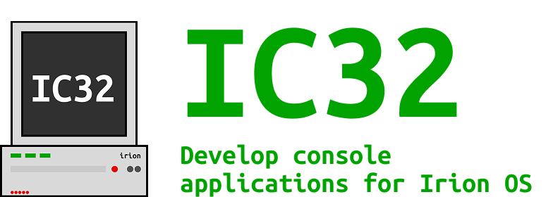

# IC32

---
# Content
- [About the project](#About-the-project)
- History the project
- Examples
- Download

# About the project
IC32 is a library for developing console programs in the C++ programming language. This library contains all the tools to create a console program for Irion OS
