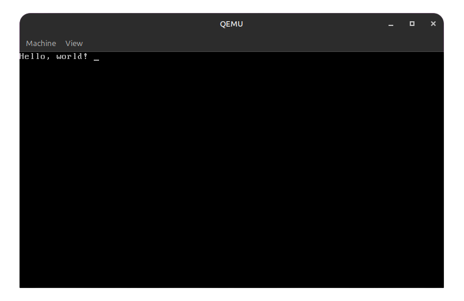

# IC32


---
# Content
- [About the project](#About-the-project)
- [Examples](#Examples)
- Download

# About the project
IC32 is a library written in NASM for developing programs for Irion OS. The library allows you to write a program in NASM for Irion OS

# Examples
``` asm
[BITS 16]
[ORG 800h]

jmp start

%include "lib/ic32.inc"
%include "lib/utils.inc"

start:
    pusha
    mov ax, 0x03
    int 0x10
    popa

    mov dl, 0 
    mov dh, 0
    call set_cursor_pos

    mov si, text
    call print_string

text db "Hello, world!", 0
```
# Result

